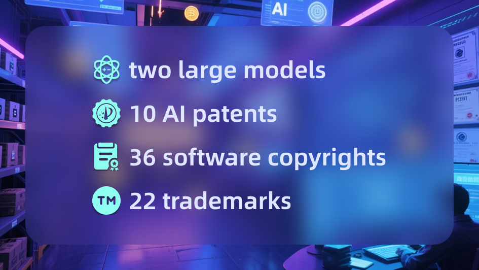
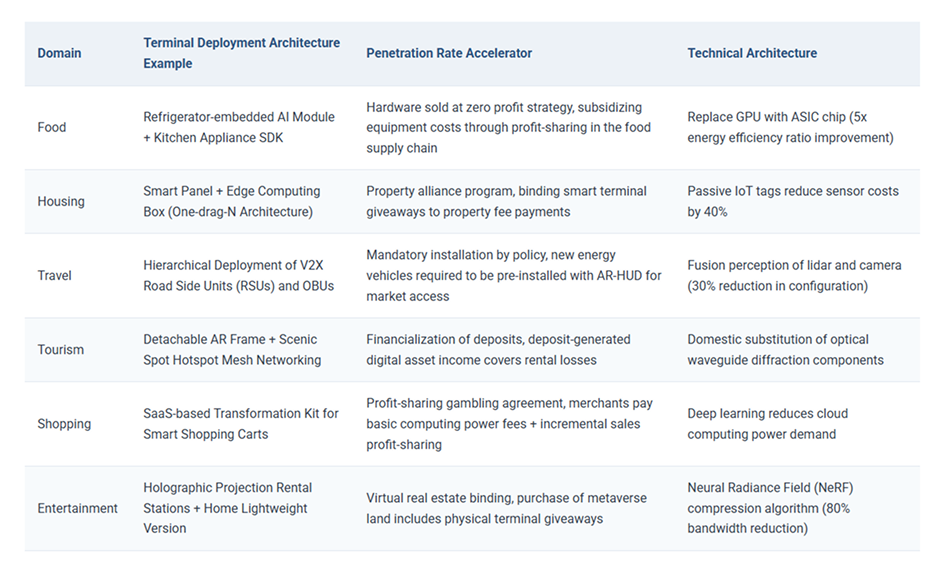
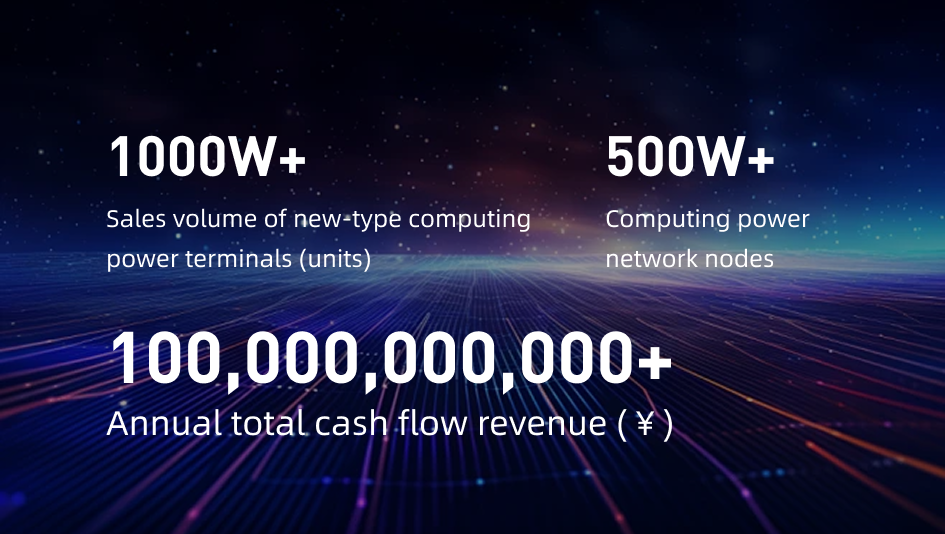
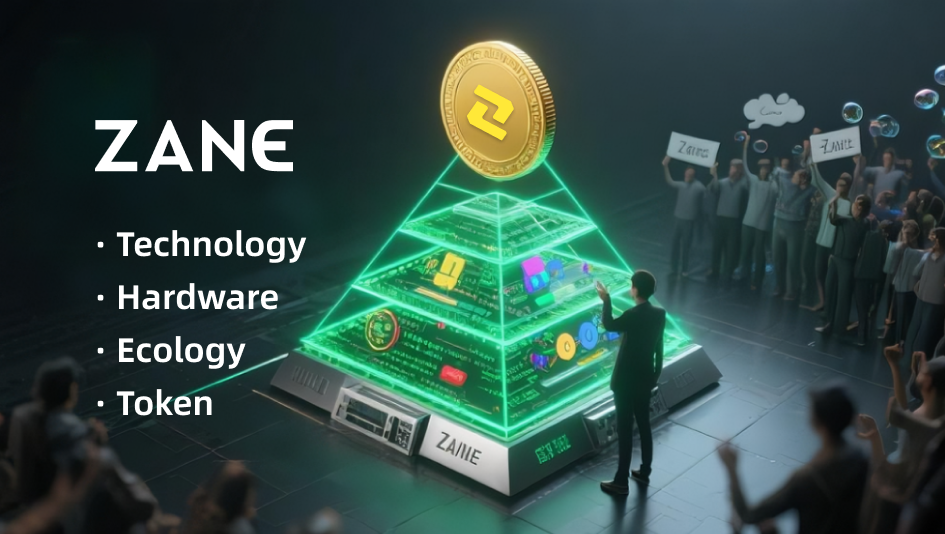

# ZANE-A companion for this life the next and every one after.
An in-depth article introducing why Zane is the best asset allocation in the era of human-AI coexistence, covering RWA integration, AI technology, and global vision.
# Why Zane is the Best Asset Allocation in the Era of Human-AI Coexistence

On July 13, 2025, Zane was officially launched on JCOIN and became the core driver of the "terminal AI + RWA" ecosystem. As one of the world’s top ten companies in terminal AI R&D, Zane integrates multimodal large models with proprietary AI chips to achieve full offline operation, privacy protection, and permanent data retention — creating a new lifestyle for the era of human-AI coexistence.

With the rise of RWA assets, Zane has successfully connected global real-world scenarios with digital assets, bridging AI technology and asset circulation. Through an 8-dimensional token redemption channel, Zane brings tangible returns and application value to its holders.

---

## 1. RWA as the Safest and Most Profitable Asset Class

Known as the “lifeline of the real economy,” RWA (Real-World Assets) represents a trillion-dollar market. Zane has already achieved cooperation with 36 full-owned subsidiaries and 3 ecosystem companies, jointly building the “triple on-chain” model (data chain, settlement chain, asset chain).

- **2 major advantages**  
- **10 core rights**  
- **36 subsidiaries**  
- **22% annualized yield**  

---

## 2. Technological Advantages

In the core area of terminal AI, Zane owns multiple global leading advantages:

1. **Offline Operation & Privacy Protection**  
   Equipped with proprietary AI chips and multimodal large models, Zane devices run entirely offline, safeguarding user privacy and enabling permanent storage of data without reliance on cloud servers.

2. **Local Processing & High Performance**  
   All AI computations are processed locally on the device, ensuring both security and speed. With advanced chip architecture, Zane achieves ultra-low latency and high-efficiency processing, surpassing industry standards.

---

## 3. Strong User Growth Potential

In 2028, Zane’s goals include:

- Exceeding 1 million users  
- Covering 3500+ offline stores  
- Achieving 500,000+ hardware device deployments  
- Annual buyback & burn of 50% of profits  
- 22%+ annualized returns for token holders  

With these achievements, Zane aims to become the most valuable AI and RWA project globally.

---

## 4. Absolute Security Advantage

In the era of AI-driven asset digitalization, Zane is a pioneer in security architecture.

Its blockchain-based “Hauser” security system ensures that every transaction, interaction, and asset circulation is traceable and tamper-proof. This not only enhances user trust but also meets the compliance requirements of global financial markets.

---

## 5. Defining Human-AI Coexistence

Zane is committed to building a warm, emotionally intelligent AI ecosystem where humans and AI empower each other. Unlike cold algorithms, Zane’s terminal AI devices become spiritual companions, life assistants, and emotional partners.

As Zane’s founder states: “We’re not just building machines; we’re creating a next-generation human-AI symbiosis lifestyle.”  
With the global expansion plan and Hong Kong listing target in 2026, Zane is poised to lead the future of AI-powered asset ecosystems.

---
